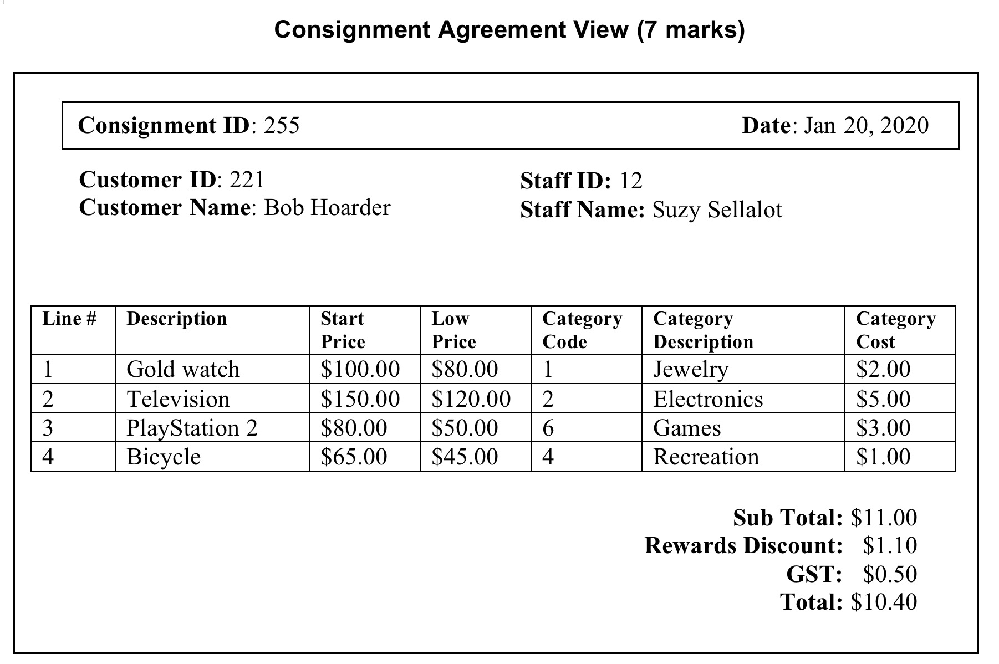
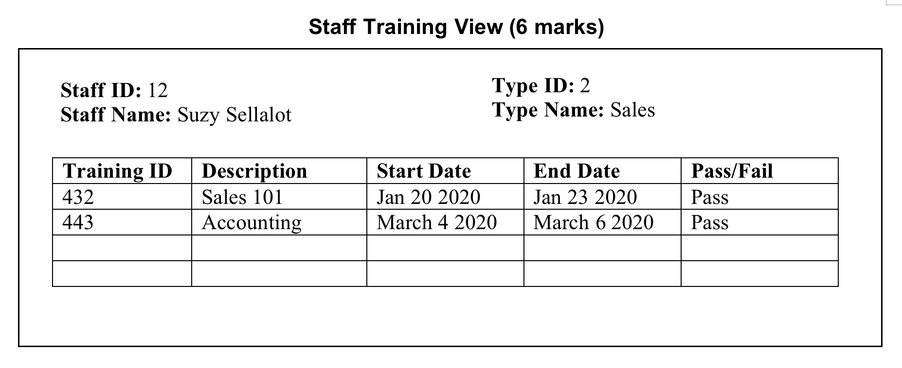
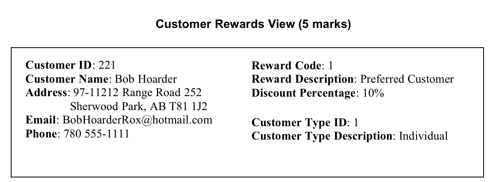

# Lab1: Stuff B Gone - Consignment Services

## Objectives

1.Produce an ERD in 3NF from source documents and client input.
2.Demonstrate initial table, first, second, and third normal forms by showing the database tables as they exist in each of the three normal forms
3.Merge 3NF solutions from different views to create one ERD of the final solution

## Requirements

Given the source documents and company description create a database design demonstrating the concept of normalization, showing all the attributes as they exist in the initial table, 1NF, 2NF, and 3NF. You will do this for each of the three views and create an ERD for each view in 3NF, as well as the final merged ERD. 

## The Company

Stuff B Gone is a company that sells customers items for them. In return for this service they collect a fee for each item they sell for the customer. Currently Stuff B Gone sells customers items through physical stores, Facebook groups/Marketplace, and Kijiji.

As an incentive to thank repeat customers, they have a reward program where customers can get discounts on their consignments. 

In order to provide the best experience for the customers, all staff are able to take training where they can improve their skills.

 - A Consignment agreement is the information that Stuff B Gone collects from the customer to be able to sell their items for them.

 - While the customer will receive the full selling price of their items, they are charged by Stuff B Gone for their services. The amount that Stuff B Gone charges for selling the customers’ items for them depends on the category the item is in. For example, if the category cost for an item is $2.00 then the charge will be $2.00 to sell that item for the customer. Examples of Categories are electronics, jewellery, etc…

 - Line # identifies each item on a particular consignment. 

 - Start Price and Low Price are the starting selling price for the item and Low Price is the lowest price that the customer is willing to sell the item for. 

 - Only one staff member works on a consignment.

 - Staff can take many different training courses.

 - Many staff can take the same training course.

 - The same training can be offered many different times. Each time it is offered it is given a new Training ID.

 - Each Staff is a certain type. These could include Sales, Promotion, etc…

 - Sometimes customers are enrolled into a reward program. If they are in a rewards program, they receive a discount on their consignment agreements.

 - A customer is only of one type (individual, business, charity, etc…)

## Merged ERD: (2 marks)
Create an ERD of your final database design for Stuff B Gone.

## Lab Submission will include the following:  
 
- An electronic copy of your Lab (not compressed) will be submitted to Moodle  
 
- A 3NF solution for each view including ALL the attributes and entities as they appear in the initial table, 1NF, 2NF, and 3NF.  
 
- An ERD for each 3NF solution of each view and an ERD of the merged solution (4 ERDs total) created with an ERD modeling tool approved by your instructor (Excel, Visio, Word, Lucidchart, DrawIO,  etc.).  

- Any additional requirements as specified by your instructor.  
 
## Other Considerations  
Do not make assumptions. If you have questions about Stuff B Gone, ask your instructor (client). This is not a group project. Working with another student on lab material may result in a grade of 0 for this lab and steps being taken in accordance with NAIT’s Academic Integrity policy. Up to 3 Marks may be deducted for incomplete lab submission requirements or poor client communication (check the provided documentation for the answer before asking the client, not clarifying assumptions, etc.).  

