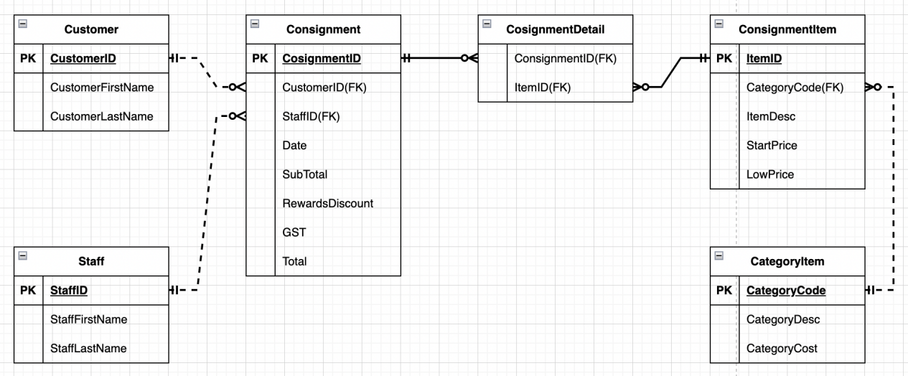
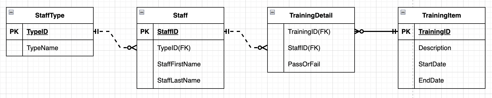
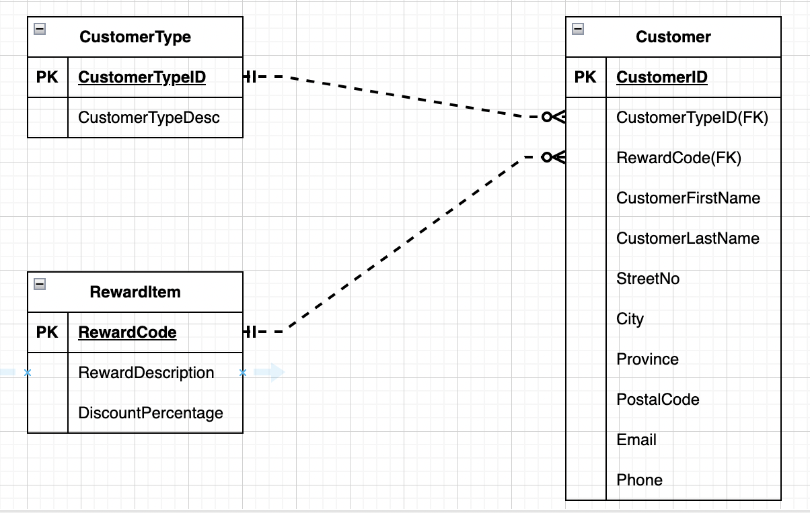
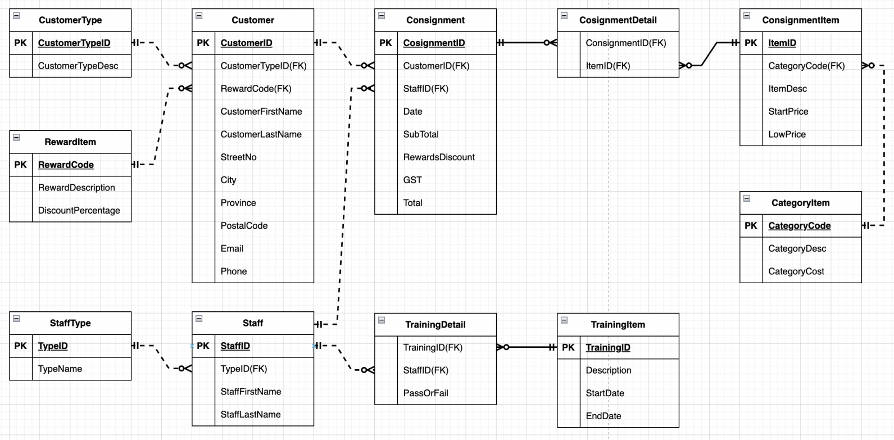

# DMIT 1508 - Lab 1: Stabff B Gone Solution

## Consignment Agreement View

### Initial Table
Consignment( ConsignmentID(PK), Date, CustomerID, CustomerName, StaffID, StaffName, (ItemDesc, StartPrice, LowPrice, CategoryCode, CategoryDesc, CategoryCost), SubTotal, RewardsDiscount, GST, Total )

### 1NF
Consignment( ConsignmentID(PK), Date, CustomerID, CustomerFirstName, CustomerLastName, StaffID, StaffFirstName, StaffLastName, SubTotal, RewardsDiscount, GST, Total)

ConsignmentDetail(ItemID(PK), ConsignmentID(FK), ItemDesc, StartPrice, LowPrice, CategoryCode, CategoryDesc, CategoryCost)

### 2NF
Consignment( ConsignmentID(PK), Date, CustomerID, CustomerFirstName, CustomerLastName, StaffID, StaffFirstName, StaffLastName, SubTotal, RewardsDiscount, GST, Total)

ConsignmentDetail(ItemID(FK), ConsignmentID(FK))

ConsignmentItem(ItemID(PK), ItemDesc, StartPrice, LowPrice, CategoryCode, CategoryDesc, CategoryCost)

### 3NF
Consignment( ConsignmentID(PK),CustomerID(FK), StaffID(FK),  Date, SubTotal, RewardsDiscount, GST, Total)

Customer(CustomerID(PK), CustomerFirstName, CustomerLastName)

Staff(StaffID(PK), StaffFirstName, StaffLastName)

ConsignmentDetail(ItemID(FK), ConsignmentID(FK))

ConsignmentItem(ItemID(PK), CategoryCode(FK), ItemDesc, StartPrice, LowPrice)

CategoryItem(CategoryCode(PK), CategoryDesc, CategoryCost)

### ERD

## Staff Training View

### Initial Table
Staff( StaffID(PK), StaffName, TypeID, TypeName, (TrainingID, Description, StartDate, EndDate, PassAndFail))

### 1NF
Staff(StaffID(PK), StaffFirstName, StaffLastName, TypeID, TypeName)

TrainingDetail(TrainingID(PK), StaffID(FK), Description, StartDate, EndDate, PassOrFail)

### 2NF
Staff(StaffID(PK), StaffFirstName, StaffLastName, TypeID, TypeName)

TrainingDetail(TrainingID(FK), StaffID(FK), PassOrFail)

TrainingItem(TrainingID(PK), Description, StartDate, EndDate)

### 3NF
Staff(StaffID(PK), TypeID(FK), StaffFirstName, StaffLastName)

StaffType(TypeID(PK), TypeName)

TrainingDetail(TrainingID(FK), StaffID(FK), PassOrFail)

TrainingItem(TrainingID(PK), Description, StartDate, EndDate)

### ERD

## Customer Rewards View

### Initial Table
Customer(CustomerID(PK), CustomerName, Address, Email, Phone, RewardCode, RewardDescription, DiscountPercentage, CustomerTypeID, CustomerTypeDesc)

### 1NF
Customer(CustomerID(PK), CustomerFirstName, CustomerLastName, StreetNo, City, Province, PostalCode, Email, Phone, RewardCode, RewardDescription, DiscountPercentage, CustomerTypeID, CustomerTypeDesc)

### 2NF
Customer(CustomerID(PK), CustomerFirstName, CustomerLastName, StreetNo, City, Province, PostalCode, Email, Phone, RewardCode, RewardDescription, DiscountPercentage, CustomerTypeID, CustomerTypeDesc)

### 3NF
Customer(CustomerID(PK), CustomerTypeID(FK), RewardCode(FK), CustomerFirstName, CustomerLastName, StreetNo, City, Province, PostalCode, Email, Phone)

RewardItem(RewardCode(PK), RewardDescription, DiscountPercentage)

CustomerType(CustomerTypeID(PK), CustomerTypeDesc)

### ERD

## Merged Tables

Customer(CustomerID(PK), CustomerTypeID(FK), RewardCode(FK), CustomerFirstName, CustomerLastName, StreetNo, City, Province, PostalCode, Email, Phone)

CustomerType(CustomerTypeID(PK), CustomerTypeDesc)

RewardItem(RewardCode(PK), RewardDescription, DiscountPercentage)

Staff(StaffID(PK), TypeID(FK), StaffFirstName, StaffLastName)

StaffType(TypeID(PK), TypeName)

TrainingDetail(TrainingID(FK), StaffID(FK), PassOrFail)

TrainingItem(TrainingID(PK), Description, StartDate, EndDate)

Consignment( ConsignmentID(PK),CustomerID(FK), StaffID(FK),  Date, SubTotal,  RewardsDiscount, GST, Total)

ConsignmentDetail(ItemID(FK), ConsignmentID(FK))

ConsignmentItem(ItemID(PK), CategoryCode(FK), ItemDesc, StartPrice, LowPrice)

CategoryItem(CategoryCode(PK), CategoryDesc, CategoryCost)

## Merged ERD

