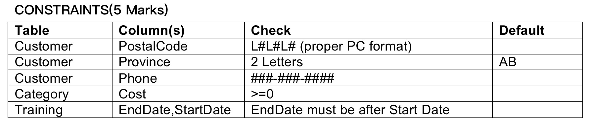
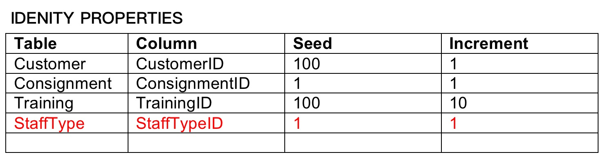
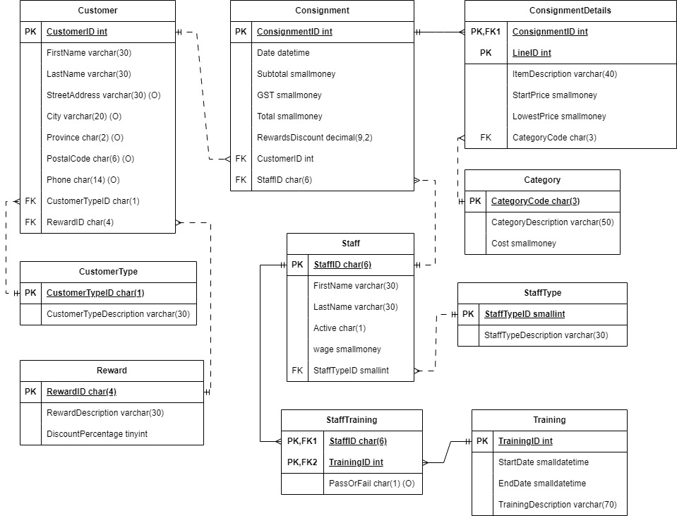

# Lab2A: Stuff B Gone
					
## Objectives: 
1.Given an ERD, define tables and constraints on the data, using the Create Table statement in SQL Server
2.Alter the definition of an existing table using the Alter Table statement. 
3.Create indexes on non-primary key fields using the Create Index statement. 
4.Insert data using the Lab2ATestData.sql file to insert data into your tables and debug any errors. 

## Requirements: 
1.Given the ERD shown in the appendix, create the required tables for the Stuff B Gone database including primary key and foreign key constraints. (10 Marks)

All the attributes that are on the ERD are required attributes and cannot be null except for attributes that show (O) after their name.

Do NOT use the Alter Table statement in this question. 

IDENTITY PROPERTY 
Ensure the correct identity properties are used on the designated tables.

A indicates any alpha character between A and Z, # indicates any digit between 0 and 9 
(3 Marks)

2.Assuming all the tables contain records, alter the tables as described below:

- Customer Table:  A 30 character attribute called email. Email addresses must match the following format:  (2 marks)
  - At least 3 letters/numbers before and after @ 
  - At least 2 letters/numbers after the period.

- Staff Table: A one character attribute called active that is required and has a default of ‘y’  (2 marks) 

## Indexes:
Create non clustered indexes on all foreign keys. (2 marks)

After you create your tables, you can run the “Lab2ATestData.sql” file to test your script by inserting data into the tables. If the Test Data script fails at some point, you have errors. 

## Submission Requirements 
Your lab submission will include the following: 

- Create a single script file called “Lab2ASolution.sql” that contains a clearly commented section of statements for each component. Each section will contain the SQL statement(s) required to complete the question. DO NOT include anything else (test data, random comments, etc.). The entire script should be able to run at once. An electronic copy of your Lab (not compressed) will be submitted to Moodle 

- If there are any known errors in your solution you must identify them at the top of your script in comments. Errors you have identified and simply could not find a solution for are more acceptable than undocumented errorsJ. Failure to document known errors will result in mark ½ mark deduction for each undocumented error up to 2 marks.

- Any additional requirements as specified by your instructor.

## Other Considerations
Do not make assumptions. If you have questions about the company, ask your instructor (client). This is not a group project. Working with another student on lab material may result in a grade of 0 for this lab. Up to 3 Marks may be deducted for incomplete lab submission requirements or poor client communication (check the provided documentation for the answer before asking the client). 

## ERD
