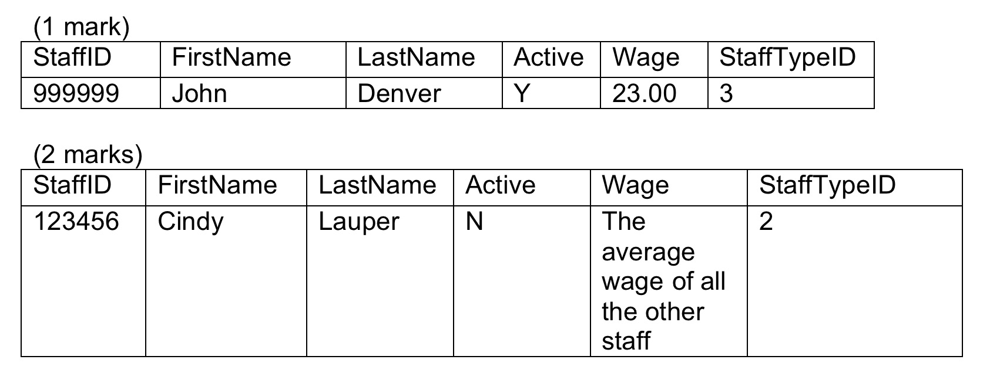
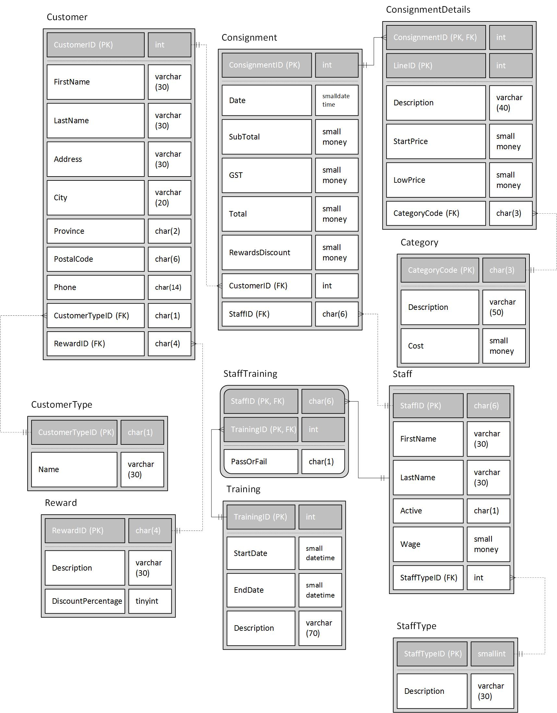

# Lab2B: Stuff B Gone!

## Objectives:

1.Select data from tables using queries.

2.Insert, Update, and Delete data using DML.

3.Create and use SQL views

## Submission Requirements 
Your lab submission will include the following: 

- Create a single script file called “Lab2ASolution.sql” that contains a clearly commented section of statements for each component. Each section will contain the SQL statement(s) required to complete the question. DO NOT include anything else (test data, random comments, etc.). The entire script should be able to run at once. An electronic copy of your Lab (not compressed) will be submitted to Moodle 

- If there are any known errors in your solution you must identify them at the top of your script in comments. Errors you have identified and simply could not find a solution for are more acceptable than undocumented errorsJ. Failure to document known errors will result in mark ½ mark deduction for each undocumented error up to 2 marks.

- Any additional requirements as specified by your instructor.

## Other Considerations
Do not make assumptions. If you have questions about the company, ask your instructor (client). This is not a group project. Working with another student on lab material may result in a grade of 0 for this lab. Up to 3 Marks may be deducted for incomplete lab submission requirements or poor client communication (check the provided documentation for the answer before asking the client). 

## Requirements

Use Lab2B.SQL to create the tables and populate them with data. You may want to add or change the data to fully test your queries. 

Write queries to select the following information from the News2Go Database.

1.Select the full name and city for the customer with customer ID 4. Show first name and last name as one column. (1 mark)

2.For all staff, select the staff first name, last name, and the number of consignments they have. (3 marks)

3.Select the average Category Cost. (1 marks)

4.Select the customer first name and last name for all customers whose total consignment subtotals are more than $20.00. (3 marks)

5.Select all the staff full names with the customer full names of the consignments they have worked on. Include staff that have not worked on any consignments (3 marks)

6.Select the first name and last name of all the customers whose last name starts with ‘S’. (1 mark)

7.Select the amount of money that was made each month this year. Show the month name and amount. List the months in chronological order by month. Do not include GST in the totals. (3 marks)

8.Select the StaffTypeDescriptions of the staff types that have no staff in them. 
(2 marks) 

9.Select the full names of all the people in the database whose lastname is between 5 and 8 characters long. (2 marks)

10.Create a view called CustomerSummary that contains CustomerID, FirstName, LastName, and the Descriptions of the items they are selling. Assume all customers have at least one item on consignment. (2 marks)

11.Using the CustomerSummary view select the Customerid, fullname, and the number of items they have on consignment.  (2 marks)

12.Write DML statements to accomplish the following:

 - Insert the following records into the Staff table given the following data:

- Change the following records given the following data:

  - Increase the DiscountPercentage of the Reward that has a RewardDescription of “Exclusive” by 2.  (2 marks)

  - The sales department is getting a raise! Increase the wage of all the sales staff by 15%. (3 marks)

  - Remove all the StaffTypes that have no Staff. (2 marks)

## ERD

