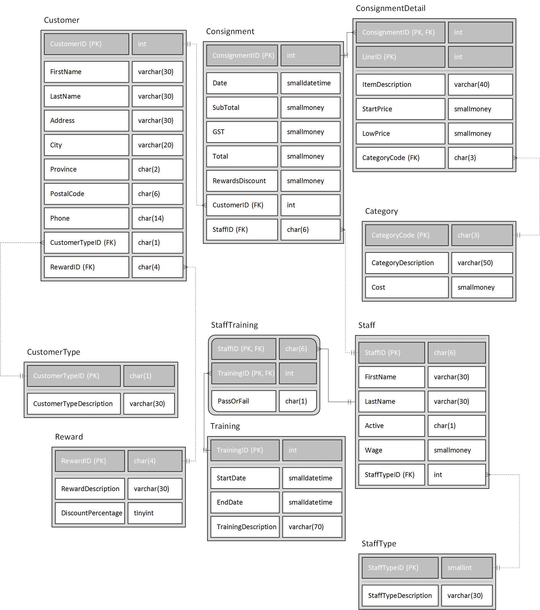

# Stuff B Gone!

## Objectives:

1. Create Database Triggers

2. Use Lab4.sql to create and populate the tables

# Requirements:
Write drop trigger statements at the top of your script. (0.5 Marks)

# Create the following SQL Database Triggers:

1. Create a trigger called Lab4Q1 to ensure that the category cost will not increase by more than 15%. If this happens raise an error and do not allow the increase. (3.5 Marks)

2. Create a trigger called Lab4Q2 to ensure that a staff member cannot be assigned to a consignment agreement unless that staff member is in the 'Sales' StaffType. If this happens, raise an error, and do not allow the transaction to proceed. (3 Marks)

3. Create a trigger called Lab4Q3 on the ConsignmentDetails that prevents any modifications to the composite PK. In other words, do not allow a ConsignmentID or LineID to be changed and raise an error if it is attempted. This restriction should not prevent the deleting of rows in ConsignmentDetails. (3 Marks)

4. Create a trigger called Lab4Q4 to add record(s) to the LogDiscountChange table when the DiscountPercentage of customer Reward changes. It will record the date and time of the change, the RewardID, the old DiscountPercentage and the new DiscountPercentage. Only add records where the DiscountPercentage value changes. The LogDiscountChange table has been included in the Lab4.sql file.     (3 Marks)

5. Create a trigger called Lab4Q5 to ensure that StartPrice and the LowPrice cannot be the same on a new ConsignmentDetail record. If this happens, raise an error, and do not allow the insert. (3 Marks) 

## ERD

